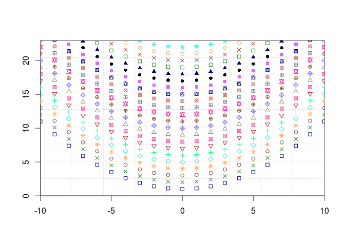
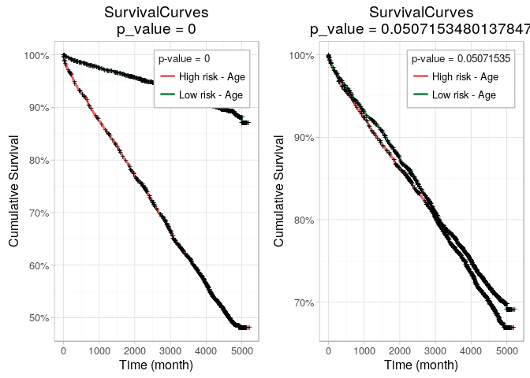
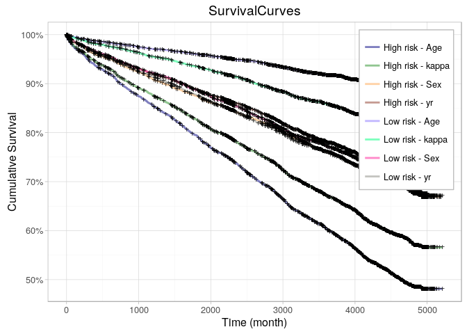

<!-- README.md is generated from README.Rmd. Please edit that file -->
Verissimo r-package
===================

With personal functions I like to reuse everytime!

-   proper() : Capitalize string using regexpression
-   draw.kaplan() : Draw kaplan curves based on Prognostic Index of Risk (calculated by coxph or something else)
-   my.colors() : My own pallete
-   my.symbols() : Same with symbols to plots
-   draw.empty.plot() : Draws an empty plot with grid to add data points or lines afterwards
-   balanced\_data: get balanced train/test sets and cv folds.
-   ... check out rest of R folder

Proper
------

One of such is a proper function that capitalizes a string.

``` r
x <- "OnE oF sUcH iS a proPer function that capitalizes a string."
proper(x)
#> [1] "One Of Such Is A Proper Function That Capitalizes A String."
```

my.colors & my.symbols & draw.empty.plot
----------------------------------------

`my.colors()` and `my.symbols()` can be used to improve plot readability.

In this example, draw.empty.plot is also used to create an empty plot to show data points after.

``` r
xdata <- -10:10
draw.empty.plot(xlim = c(min(xdata),max(xdata)), ylim = c(0,23))
for (ix in 1:22) {
  points(xdata, 1/10 * xdata * xdata + ix, pch = my.symbols(ix), col = my.colors(ix), cex = .9)
}
```



draw.kaplan
-----------

``` r
suppressPackageStartupMessages(library(survival))
suppressPackageStartupMessages(library(plyr))
suppressPackageStartupMessages(library(ggfortify))
suppressPackageStartupMessages(library(gridExtra))
data(flchain)
ydata <- data.frame( time = flchain$futime, status = flchain$death)
xdata <- cbind(flchain$age, as.numeric(flchain$sex == 'M') * 2 + 1, flchain$sample.yr, flchain$kappa)
page <- draw.kaplan(list(Age= c(1,0,0,0)), xdata = xdata, ydata = ydata)$plot
psex <- draw.kaplan(list(Sex= c(0,1,0,0)), xdata = xdata, ydata = ydata)$plot
grid.arrange(page, psex, ncol = 2)
```



``` r
#
draw.kaplan(list(Age= c(1,0,0,0), Sex = c(0,1,0,0), yr = c(0,0,1,0), kappa = c(0,0,0,1)), xdata = xdata, ydata = ydata)$plot
```



Balanced test/train dataset
---------------------------

This is specially relevant in survival or binary output with few cases of one category that need to be well distributed among test/train datasets or in cross-validation folds.

Example below sets aside 90% of the data to the training set. As samples are already divided in two sets (`set1` and `set2`), it performs the 90% separation for each and then joins (with option `join.all = T`) the result.

``` r
set1 <- c(T,T,T,T,T,T,T,T,F,T,T,T,T,T,T,T,T,T,F,T)
set2 <- !set1
cat('Set1\n', set1, '\n\nSet2\n', set2, '\n\nTraining / Test set using logical indices\n\n')
set.seed(1985)
balanced.train.and.test(set1, set2, train.perc = .9)
#
set1 <- which(set1)
set2 <- which(set2)
cat('##### Same sets but using numeric indices\n\n', 'Set1\n', set1, '\n\nSet2\n', set2, '\n\nTraining / Test set using numeric indices\n')
set.seed(1985)
balanced.train.and.test(set1, set2, train.perc = .9)
#> Set1
#>  TRUE TRUE TRUE TRUE TRUE TRUE TRUE TRUE FALSE TRUE TRUE TRUE TRUE TRUE TRUE TRUE TRUE TRUE FALSE TRUE 
#> 
#> Set2
#>  FALSE FALSE FALSE FALSE FALSE FALSE FALSE FALSE TRUE FALSE FALSE FALSE FALSE FALSE FALSE FALSE FALSE FALSE TRUE FALSE 
#> 
#> Training / Test set using logical indices
#> 
#> $train
#>  [1]  1  2  3  4  5  6  7  8  9 10 11 13 14 15 16 17 18
#> 
#> $test
#> [1] 12 19 20
#> 
#> ##### Same sets but using numeric indices
#> 
#>  Set1
#>  1 2 3 4 5 6 7 8 10 11 12 13 14 15 16 17 18 20 
#> 
#> Set2
#>  9 19 
#> 
#> Training / Test set using numeric indices
#> $train
#>  [1]  1  2  3  4  5  6  7  8  9 10 11 13 14 15 16 17 18
#> 
#> $test
#> [1] 12 19 20
```
