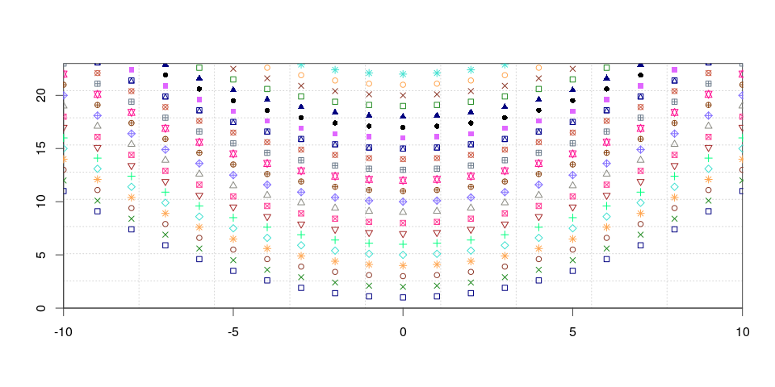
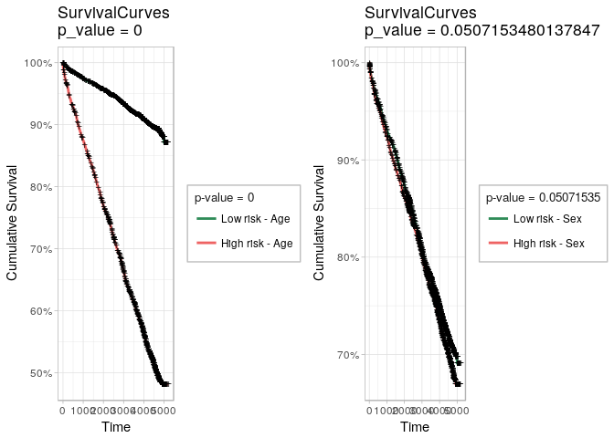
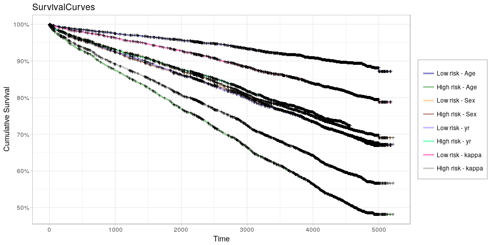
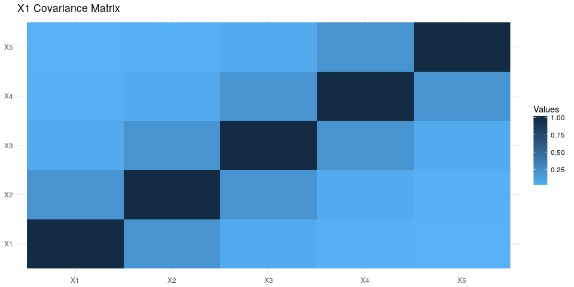
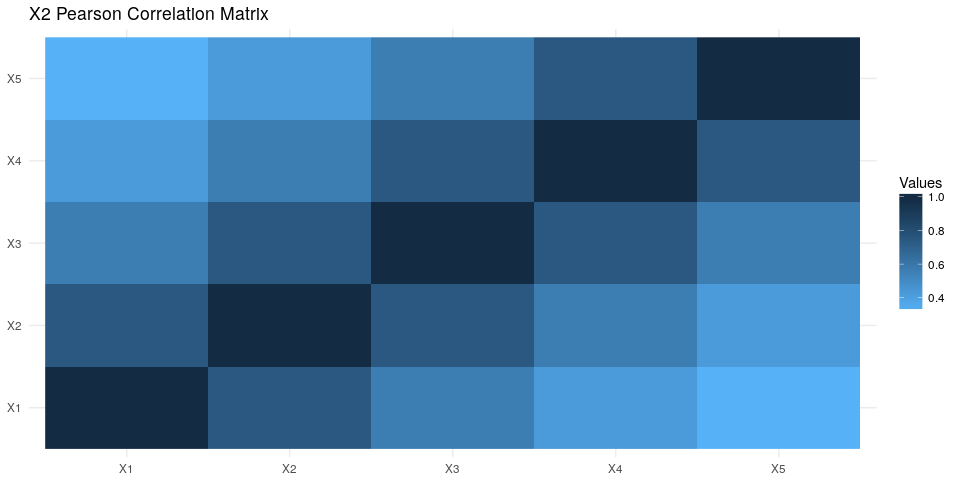

<!-- README.md is generated from README.Rmd. Please edit that file -->
loose.rock r-package
====================

> Set of useful function that I reuse a lot

[](https://travis-ci.org/averissimo/loose.rock) [](https://codecov.io/github/averissimo/loose.rock?branch=master)

Overview
--------

With personal functions I like to reuse everytime!

-   proper() : Capitalize string using regexpression
-   draw.kaplan() : Draw kaplan curves based on Prognostic Index of Risk (calculated by coxph or something else)
-   my.colors() : My own pallete
-   my.symbols() : Same with symbols to plots
-   draw.empty.plot() : Draws an empty plot with grid to add data points or lines afterwards
-   balanced\_data: get balanced train/test sets and cv folds.
-   gen.synth.xdata(): generate random matrix with pre-determined covariance
-   run.cache(): keep cache or results of a function
-   ... check out rest of R folder

### Install

``` r
devtools::install_github('averissimo/loose.rock)
```

Proper
------

One of such is a proper function that capitalizes a string.

``` r
x <- "OnE oF sUcH iS a proPer function that capitalizes a string."
proper(x)
#> [1] "One Of Such Is A Proper Function That Capitalizes A String."
```

my.colors & my.symbols & draw.empty.plot
----------------------------------------

`my.colors()` and `my.symbols()` can be used to improve plot readability.

In this example, draw.empty.plot is also used to create an empty plot to show data points after.

``` r
xdata <- -10:10
draw.empty.plot(xlim = c(min(xdata),max(xdata)), ylim = c(0,23))
for (ix in 1:22) {
  points(xdata, 1/10 * xdata * xdata + ix, pch = my.symbols(ix), col = my.colors(ix), cex = .9)
}
```



draw.kaplan
-----------

``` r
suppressPackageStartupMessages(library(survival))
suppressPackageStartupMessages(library(plyr))
suppressPackageStartupMessages(library(ggfortify))
suppressPackageStartupMessages(library(gridExtra))
data(flchain)
ydata <- data.frame( time = flchain$futime, status = flchain$death)
xdata <- cbind(flchain$age, as.numeric(flchain$sex == 'M') * 2 + 1, flchain$sample.yr, flchain$kappa)
page <- draw.kaplan(list(Age= c(1,0,0,0)), xdata = xdata, ydata = ydata)$plot
psex <- draw.kaplan(list(Sex= c(0,1,0,0)), xdata = xdata, ydata = ydata)$plot
grid.arrange(page, psex, ncol = 2)
```



``` r
#
draw.kaplan(list(Age= c(1,0,0,0), Sex = c(0,1,0,0), yr = c(0,0,1,0), kappa = c(0,0,0,1)), xdata = xdata, ydata = ydata)$plot
```



Balanced test/train dataset
---------------------------

This is specially relevant in survival or binary output with few cases of one category that need to be well distributed among test/train datasets or in cross-validation folds.

Example below sets aside 90% of the data to the training set. As samples are already divided in two sets (`set1` and `set2`), it performs the 90% separation for each and then joins (with option `join.all = T`) the result.

``` r
set1 <- c(T,T,T,T,T,T,T,T,F,T,T,T,T,T,T,T,T,T,F,T)
set2 <- !set1
cat('Set1\n', set1, '\n\nSet2\n', set2, '\n\nTraining / Test set using logical indices\n\n')
set.seed(1985)
balanced.train.and.test(set1, set2, train.perc = .9)
#
set1 <- which(set1)
set2 <- which(set2)
cat('##### Same sets but using numeric indices\n\n', 'Set1\n', set1, '\n\nSet2\n', set2, '\n\nTraining / Test set using numeric indices\n')
set.seed(1985)
balanced.train.and.test(set1, set2, train.perc = .9)
#
#> Set1
#>  TRUE TRUE TRUE TRUE TRUE TRUE TRUE TRUE FALSE TRUE TRUE TRUE TRUE TRUE TRUE TRUE TRUE TRUE FALSE TRUE 
#> 
#> Set2
#>  FALSE FALSE FALSE FALSE FALSE FALSE FALSE FALSE TRUE FALSE FALSE FALSE FALSE FALSE FALSE FALSE FALSE FALSE TRUE FALSE 
#> 
#> Training / Test set using logical indices
#> 
#> $train
#>  [1]  1  2  3  4  5  6  7  8  9 10 11 13 14 15 16 17 18
#> 
#> $test
#> [1] 12 19 20
#> 
#> ##### Same sets but using numeric indices
#> 
#>  Set1
#>  1 2 3 4 5 6 7 8 10 11 12 13 14 15 16 17 18 20 
#> 
#> Set2
#>  9 19 
#> 
#> Training / Test set using numeric indices
#> $train
#>  [1]  1  2  3  4  5  6  7  8  9 10 11 13 14 15 16 17 18
#> 
#> $test
#> [1] 12 19 20
```

Generate synthetic matrix with covariance
-----------------------------------------

``` r
xdata1 <- gen.synth.xdata(10, 5, .2)
xdata2 <- gen.synth.xdata(10, 5, .75)
```

    #> Using .2^|i-j| to generate co-variance matrix
    #> X generated
    #>             X1         X2         X3         X4         X5
    #> 1   0.09689175  0.9468821  1.3552340  1.2824676  0.4190769
    #> 2   0.19084771 -0.4300693  1.5705338  0.2006243 -1.2941223
    #> 3   0.93644208 -0.3945288 -0.0570492 -0.5691152  0.2626026
    #> 4   0.07218033  0.3558250 -1.5559584 -1.0373982 -1.6702955
    #> 5   0.49333811 -0.8816076 -0.9225416 -0.4309264  1.4476294
    #> 6   0.24457253 -1.6353932 -0.6294087  1.3615857 -0.2112758
    #> 7   1.59587882  1.7799506  0.1623247 -0.2918553 -0.1509117
    #> 8  -1.42564382 -0.7091118  0.5150353 -1.7232931 -0.1749990
    #> 9  -0.48595798  0.6337266  0.3455646  0.3907845  1.4462497
    #> 10 -1.71854953  0.3343264 -0.7837344  0.8171261 -0.0739543
    #> cov(X)
    #>       X1    X2   X3    X4     X5
    #> 1 1.0000 0.200 0.04 0.008 0.0016
    #> 2 0.2000 1.000 0.20 0.040 0.0080
    #> 3 0.0400 0.200 1.00 0.200 0.0400
    #> 4 0.0080 0.040 0.20 1.000 0.2000
    #> 5 0.0016 0.008 0.04 0.200 1.0000



    #> Using .75^|i-j| to generate co-variance matrix (plotting correlation)
    #> X generated
    #>            X1         X2          X3          X4          X5
    #> 1   0.4208010  0.9286722  1.45831161  1.67371415  1.17461275
    #> 2  -1.1038121 -1.2636549 -0.07741947  0.41873089  1.06764561
    #> 3   1.7356855  0.4526740 -0.37879089 -0.02327963  0.30411766
    #> 4  -1.0318495 -0.6538382 -1.18185378 -0.08377025 -0.08410934
    #> 5   0.1145984 -0.2168866 -0.21616338 -0.26522464 -1.74803648
    #> 6   1.0900261  1.1550673  1.12052081 -0.12683280  0.60808321
    #> 7  -0.2929580  1.1762793  0.21909445 -0.13175354 -0.07821635
    #> 8   0.8276833  0.7144643  1.11215892  1.37228251  0.75499461
    #> 9  -0.9345230 -1.1943438 -0.46819589 -1.49889929 -1.43608946
    #> 10 -0.8256519 -1.0984336 -1.58766238 -1.33496740 -0.56300222
    #> cov(X)
    #>          X1       X2     X3       X4        X5
    #> 1 1.0000000 0.750000 0.5625 0.421875 0.3164063
    #> 2 0.7500000 1.000000 0.7500 0.562500 0.4218750
    #> 3 0.5625000 0.750000 1.0000 0.750000 0.5625000
    #> 4 0.4218750 0.562500 0.7500 1.000000 0.7500000
    #> 5 0.3164063 0.421875 0.5625 0.750000 1.0000000



Save in cache
-------------

Uses a cache to save and retrieve results. The cache is automatically created with the arguments and source code for function, so that if any of those changes, the cache is regenerated.

Caution: Files are not deleted so the cache directory can become rather big.

``` r
a <- run.cache(sum, 1, 2)
#> Loading from cache (not calculating): ./run-cache/561a/cache-generic_cache-H_561a43a3af7b265aed512a7995a46f89c382f78fdba4170e569495892b0076ba.RData
b <- run.cache(sum, 1, 2)
#> Loading from cache (not calculating): ./run-cache/561a/cache-generic_cache-H_561a43a3af7b265aed512a7995a46f89c382f78fdba4170e569495892b0076ba.RData
all(a == b)
#> [1] TRUE
```

``` r
a <- run.cache(rnorm, 5, seed = 1985)
#> Loading from cache (not calculating): ./run-cache/9636/cache-generic_cache-H_96360922babcb9eeb480fabc9811eab598abaf087c10f3ef49e9093607089531.RData
b <- run.cache(rnorm, 5, seed = 2000)
#> Loading from cache (not calculating): ./run-cache/ab76/cache-generic_cache-H_ab768ab59eab0e3848e3f5b8c133baaa381eb1e6d5fda439f10847d911b0ace7.RData
all(a == b)
#> [1] FALSE
```

run-cache was originaly intended to be used to calculate big correlation matrix

``` r
n.rows <- 1000
n.cols <- 50000
xdata <- matrix(rnorm(n.rows * n.cols), ncol = n.cols)
# making sure cache is saved
.Last.value <- run.cache(sapply, 2:n.cols, function(ix) {cor(xdata[,1], xdata[,ix])})
#> Saving in cache: ./run-cache/3f20/cache-generic_cache-H_3f207dc73c53d47c0c688a85a6dc0280eebcea9a20e81f1c04d4928fc9c4ce99.RData
run.cache.digest <- list(digest.cache(xdata))
my.fun <- function(ix) {cor(xdata[,1], xdata[,ix])}
microbenchmark::microbenchmark(
  run.cche.non.cached    = run.cache(sapply, 2:n.cols, my.fun, show.message = FALSE, force.recalc = T),
  run.cache.cached       = run.cache(sapply, 2:n.cols, my.fun, show.message = FALSE),
  run.cache.cached.speed = run.cache(sapply, 2:n.cols, my.fun, cache.digest = runCache.digest, show.message = FALSE),
  actual.function        = sapply(2:n.cols, my.fun), 
  actual.4cores          = unlist(parallel::mclapply(2:n.cols, my.fun, mc.cores = 4)),
  times = 5)
#> Unit: milliseconds
#>                    expr         min          lq      mean       median
#>     run.cche.non.cached 3959.987150 6135.966964 9918.5143 10559.224587
#>        run.cache.cached    6.402426    6.570234 1036.1713     6.618979
#>  run.cache.cached.speed    4.672045    5.154532  971.9428    12.603810
#>         actual.function 3129.551983 4214.885400 5305.9562  4373.048324
#>           actual.4cores 2925.982155 3018.165776 5269.6949  6543.040907
#>            uq       max neval cld
#>  13551.949580 15385.443     5   b
#>      9.621187  5151.644     5  a 
#>     14.086849  4823.197     5  a 
#>   4722.546613 10089.749     5  ab
#>   6755.803357  7105.482     5  ab
```
