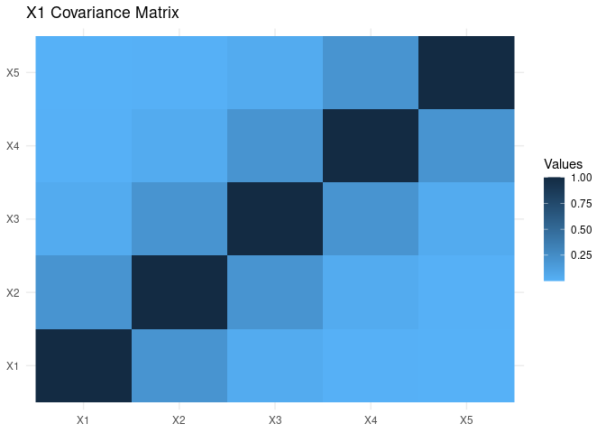

<!-- README.md is generated from README.Rmd. Please edit that file -->
loose rock 
==================================================================================

> Set of Functions to Use Survival Analysis and in Data Science

[](https://travis-ci.org/averissimo/loose.rock) [](https://ci.appveyor.com/api/projects/status/qnc5ck55pf574qj6?svg=true) [](https://codecov.io/github/averissimo/loose.rock?branch=master) [](https://cran.r-project.org/package=loose.rock) [](https://cran.r-project.org/package=loose.rock)

Collection of function to improve workflow in survival analysis and data science. Among the many features, the generation of balanced datasets, retrieval of protein coding genes from two public databases (live) and generation of random matrix based on covariance matrix.

The work has been mainly supported by two grants: FCT SFRH/BD/97415/2013 and the EU Commission under SOUND project with contract number 633974.

### Install

The only pre-requirement is to install `biomaRt` bioconductor package as it cannot be installed automatically via CRAN.

All other dependencies should be installed when running the install command.

``` r
# install bioconductor
## try http:// if https:// URLs are not supported
source("https://bioconductor.org/biocLite.R")
biocLite()

# install the package
biocLite('averissimo/loose.rock', dependencies = TRUE)

# use the package
library(loose.rock)
```

### Overview

-   `coding.genes()`: downloads protein coding genes from external databases
-   `gen.synth.xdata()`: generate random matrix with pre-determined covariance
-   `balanced.cv.folds()` and `balanced.train.and.test()`: get balanced train/test sets and cv folds.
-   `run.cache()`: keep cache or results of a function
-   `proper()` : Capitalize string using regexpression
-   `my.colors()` : My own pallete
-   `my.symbols()` : Same with symbols to plots
-   ... check out rest of Documentation

Get a current list of protein coding genes
------------------------------------------

Showing only a random sample of 15

``` r
genes <- coding.genes()
#> Coding genes from biomaRt: 22643 
#>    Coding genes from CCDS: 19631 
#>         Unique in biomaRt: 547 
#>            Unique in CCDS: 1074 
#> -------------------------------
#>                     genes: 23145
genes %>%
  arrange(external_gene_name) %>% {
   slice(., sample(seq(nrow(.)), 15)) 
  } %>%
  knitr::kable()
```

| ensembl\_gene\_id | external\_gene\_name |
|:------------------|:---------------------|
| ENSG00000170788   | DYDC1                |
| ENSG00000198130   | HIBCH                |
| ENSG00000092847   | AGO1                 |
| ENSG00000139505   | MTMR6                |
| ENSG00000128040   | SPINK2               |
| ENSG00000116221   | MRPL37               |
| ENSG00000184108   | TRIML1               |
| ENSG00000155066   | PROM2                |
| ENSG00000171557   | FGG                  |
| ENSG00000102984   | ZNF821               |
| ENSG00000223852   | ZFP57                |
| ENSG00000198168   | SVIP                 |
| ENSG00000141456   | PELP1                |
| ENSG00000117859   | OSBPL9               |
| ENSG00000162461   | SLC25A34             |

Balanced test/train dataset
---------------------------

This is specially relevant in survival or binary output with few cases of one category that need to be well distributed among test/train datasets or in cross-validation folds.

Example below sets aside 90% of the data to the training set. As samples are already divided in two sets (`set1` and `set2`), it performs the 90% separation for each and then joins (with option `join.all = T`) the result.

``` r
set1 <- c(T,T,T,T,T,T,T,T,F,T,T,T,T,T,T,T,T,T,F,T)
set2 <- !set1
cat('Set1\n', set1, '\n\nSet2\n', set2, '\n\nTraining / Test set using logical indices\n\n')
set.seed(1985)
balanced.train.and.test(set1, set2, train.perc = .9)
#
set1 <- which(set1)
set2 <- which(set2)
cat('##### Same sets but using numeric indices\n\n', 'Set1\n', set1, '\n\nSet2\n', set2, '\n\nTraining / Test set using numeric indices\n')
set.seed(1985)
balanced.train.and.test(set1, set2, train.perc = .9)
#
#> Set1
#>  TRUE TRUE TRUE TRUE TRUE TRUE TRUE TRUE FALSE TRUE TRUE TRUE TRUE TRUE TRUE TRUE TRUE TRUE FALSE TRUE 
#> 
#> Set2
#>  FALSE FALSE FALSE FALSE FALSE FALSE FALSE FALSE TRUE FALSE FALSE FALSE FALSE FALSE FALSE FALSE FALSE FALSE TRUE FALSE 
#> 
#> Training / Test set using logical indices
#> 
#> $train
#>  [1]  1  2  3  4  5  6  7  8  9 10 11 13 14 15 16 17 18
#> 
#> $test
#> [1] 12 19 20
#> 
#> ##### Same sets but using numeric indices
#> 
#>  Set1
#>  1 2 3 4 5 6 7 8 10 11 12 13 14 15 16 17 18 20 
#> 
#> Set2
#>  9 19 
#> 
#> Training / Test set using numeric indices
#> $train
#>  [1]  1  2  3  4  5  6  7  8  9 10 11 13 14 15 16 17 18
#> 
#> $test
#> [1] 12 19 20
```

Generate synthetic matrix with covariance
-----------------------------------------

``` r
xdata1 <- gen.synth.xdata(10, 5, .2)
xdata2 <- gen.synth.xdata(10, 5, .75)
```

    #> Using .2^|i-j| to generate co-variance matrix
    #> X generated
    #>            X1         X2         X3         X4           X5
    #> 1   0.1944384  0.7614053  1.5732604  1.0969908  0.516623623
    #> 2  -0.2088722  0.3299644  0.6771205  0.9606580 -1.693842188
    #> 3   0.5282128  0.3816847 -0.9694817  0.2070983 -0.145626644
    #> 4   0.6035690 -0.6545657 -0.3682524 -2.0477890 -1.138906864
    #> 5   0.1594990 -0.2468407 -1.6687048  0.2038405  1.113790270
    #> 6   0.3644722 -1.8633723 -0.3614212  1.1336067 -0.091376129
    #> 7   1.7395142  1.5068401  0.4833638 -0.5649658 -0.007276351
    #> 8  -2.0126534  0.4070373 -0.7969888 -0.6071440 -0.762008597
    #> 9  -0.4556821  0.5761596  0.4132342  0.3332174  1.476525617
    #> 10 -0.9124980 -1.1983127  1.0178702 -0.7155129  0.732097263
    #> cov(X)
    #>       X1    X2   X3    X4     X5
    #> 1 1.0000 0.200 0.04 0.008 0.0016
    #> 2 0.2000 1.000 0.20 0.040 0.0080
    #> 3 0.0400 0.200 1.00 0.200 0.0400
    #> 4 0.0080 0.040 0.20 1.000 0.2000
    #> 5 0.0016 0.008 0.04 0.200 1.0000



    #> Using .75^|i-j| to generate co-variance matrix (plotting correlation)
    #> X generated
    #>            X1         X2          X3          X4          X5
    #> 1   0.4208010  0.9286722  1.45831161  1.67371415  1.17461275
    #> 2  -1.1038121 -1.2636549 -0.07741947  0.41873089  1.06764561
    #> 3   1.7356855  0.4526740 -0.37879089 -0.02327963  0.30411766
    #> 4  -1.0318495 -0.6538382 -1.18185378 -0.08377025 -0.08410934
    #> 5   0.1145984 -0.2168866 -0.21616338 -0.26522464 -1.74803648
    #> 6   1.0900261  1.1550673  1.12052081 -0.12683280  0.60808321
    #> 7  -0.2929580  1.1762793  0.21909445 -0.13175354 -0.07821635
    #> 8   0.8276833  0.7144643  1.11215892  1.37228251  0.75499461
    #> 9  -0.9345230 -1.1943438 -0.46819589 -1.49889929 -1.43608946
    #> 10 -0.8256519 -1.0984336 -1.58766238 -1.33496740 -0.56300222
    #> cov(X)
    #>          X1       X2     X3       X4        X5
    #> 1 1.0000000 0.750000 0.5625 0.421875 0.3164062
    #> 2 0.7500000 1.000000 0.7500 0.562500 0.4218750
    #> 3 0.5625000 0.750000 1.0000 0.750000 0.5625000
    #> 4 0.4218750 0.562500 0.7500 1.000000 0.7500000
    #> 5 0.3164062 0.421875 0.5625 0.750000 1.0000000


Save in cache
-------------

Uses a cache to save and retrieve results. The cache is automatically created with the arguments and source code for function, so that if any of those changes, the cache is regenerated.

Caution: Files are not deleted so the cache directory can become rather big.

``` r
a <- run.cache(sum, 1, 2)
#> Loading from cache (not calculating): ./run-cache/561a/cache-generic_cache-H_561a43a3af7b265aed512a7995a46f89c382f78fdba4170e569495892b0076ba.RData
b <- run.cache(sum, 1, 2)
#> Loading from cache (not calculating): ./run-cache/561a/cache-generic_cache-H_561a43a3af7b265aed512a7995a46f89c382f78fdba4170e569495892b0076ba.RData
all(a == b)
#> [1] TRUE
```

``` r
a <- run.cache(rnorm, 5, seed = 1985)
#> Loading from cache (not calculating): ./run-cache/9636/cache-generic_cache-H_96360922babcb9eeb480fabc9811eab598abaf087c10f3ef49e9093607089531.RData
b <- run.cache(rnorm, 5, seed = 2000)
#> Loading from cache (not calculating): ./run-cache/ab76/cache-generic_cache-H_ab768ab59eab0e3848e3f5b8c133baaa381eb1e6d5fda439f10847d911b0ace7.RData
all(a == b)
#> [1] FALSE
```

Proper
------

One of such is a proper function that capitalizes a string.

``` r
x <- "OnE oF sUcH iS a proPer function that capitalizes a string."
proper(x)
#> [1] "One Of Such Is A Proper Function That Capitalizes A String."
```

Custom colors and symbols
-------------------------

`my.colors()` and `my.symbols()` can be used to improve plot readability.

``` r
xdata <- -10:10
plot(xdata, 1/10 * xdata * xdata + 1, type="l", pch = my.symbols(1), col = my.colors(1), cex = .9,
     xlab = '', ylab = '', ylim = c(0, 20))
grid(NULL, NULL, lwd = 2) # grid only in y-direction
for (ix in 2:22) {
  points(xdata, 1/10 * xdata * xdata + ix, pch = my.symbols(ix), col = my.colors(ix), cex = .9)
}
```


