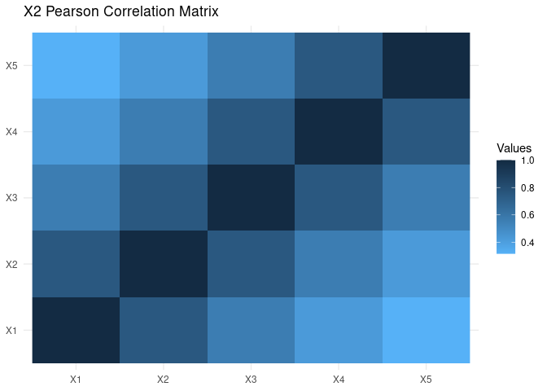

Overview of loose.rock
================
André Veríssimo
2021-02-13

<!-- README.md is generated from README.Rmd. Please edit that file -->

# loose rock


> Set of Functions to Use in Survival Analysis and in Data Science


[](https://codecov.io/github/averissimo/loose.rock?branch=master)
[](https://cran.r-project.org/package=loose.rock)

Collection of function to improve workflow in survival analysis and data
science. Among the many features, the generation of balanced datasets,
retrieval of protein coding genes from two public databases (live) and
generation of random matrix based on covariance matrix.

The work has been mainly supported by two grants: FCT SFRH/BD/97415/2013
and the EU Commission under SOUND project with contract number 633974.

### Install

The only pre-requirement is to install `biomaRt` bioconductor package as
it cannot be installed automatically via CRAN.

All other dependencies should be installed when running the install
command.

``` r
if (!require("BiocManager"))
  install.packages("BiocManager")
BiocManager::install("loose.rock")

# use the package
library(loose.rock)
```

### Overview

-   `coding.genes()`: downloads protein coding genes from external
    databases
-   `gen.synth.xdata()`: generate random matrix with pre-determined
    covariance
-   `balanced.cv.folds()` and `balanced.train.and.test()`: get balanced
    train/test sets and cv folds.
-   `run.cache()`: keep cache or results of a function
-   `proper()` : Capitalize string using regexpression
-   `my.colors()` : My own pallete
-   `my.symbols()` : Same with symbols to plots
-   … check out rest of Documentation

## Libraries required for this vignette

``` r
library(dplyr)
```

## Get a current list of protein coding genes

Showing only a random sample of 15

``` r
coding.genes() %>%
  arrange(external_gene_name) %>% {
   slice(., sample(seq(nrow(.)), 15)) 
  } %>%
  knitr::kable()
```

| ensembl\_gene\_id | external\_gene\_name |
|:------------------|:---------------------|
| ENSG00000129152   | MYOD1                |
| ENSG00000196539   | OR2T3                |
| ENSG00000205269   | TMEM170B             |
| ENSG00000100731   | PCNX1                |
| ENSG00000115993   | TRAK2                |
| ENSG00000186790   | FOXE3                |
| ENSG00000135355   | GJA10                |
| ENSG00000206478   | IER3                 |
| ENSG00000178878   | APOLD1               |
| ENSG00000143578   | CREB3L4              |
| ENSG00000130816   | DNMT1                |
| ENSG00000128218   | VPREB3               |
| ENSG00000279000   | OR10A6               |
| ENSG00000130540   | SULT4A1              |
| ENSG00000176787   | OR52E2               |

## Balanced test/train dataset

This is specially relevant in survival or binary output with few cases
of one category that need to be well distributed among test/train
datasets or in cross-validation folds.

Example below sets aside 90% of the data to the training set. As samples
are already divided in two sets (`set1` and `set2`), it performs the 90%
separation for each and then joins (with option `join.all = T`) the
result.

``` r
set1 <- c(rep(TRUE, 8), FALSE, rep(TRUE, 9), FALSE, TRUE)
set2 <- !set1
cat(
  'Set1', '\n', set1, '\n\n',
  'Set2', '\n', set2, '\n\n',
  'Training / Test set using logical indices', '\n\n'
)
set.seed(1985)
balanced.train.and.test(set1, set2, train.perc = .9)
#
set1 <- which(set1)
set2 <- which(set2)
cat(
  '##### Same sets but using numeric indices', '\n\n', 
  'Set1', '\n', set1, '\n\n', 
  'Set2', '\n', set2, '\n\n', 
  'Training / Test set using numeric indices', '\n')
set.seed(1985)
balanced.train.and.test(set1, set2, train.perc = .9)
#
#> Set1 
#>  TRUE TRUE TRUE TRUE TRUE TRUE TRUE TRUE FALSE TRUE TRUE TRUE TRUE TRUE TRUE TRUE TRUE TRUE FALSE TRUE 
#> 
#>  Set2 
#>  FALSE FALSE FALSE FALSE FALSE FALSE FALSE FALSE TRUE FALSE FALSE FALSE FALSE FALSE FALSE FALSE FALSE FALSE TRUE FALSE 
#> 
#>  Training / Test set using logical indices 
#> 
#> $train
#>  [1]  1  2  3  4  5  6  7  8  9 10 11 12 14 15 17 18 20
#> 
#> $test
#> [1] 13 16 19
#> 
#> ##### Same sets but using numeric indices 
#> 
#>  Set1 
#>  1 2 3 4 5 6 7 8 10 11 12 13 14 15 16 17 18 20 
#> 
#>  Set2 
#>  9 19 
#> 
#>  Training / Test set using numeric indices 
#> $train
#>  [1]  1  2  3  4  5  6  7  8  9 10 11 12 14 15 17 18 20
#> 
#> $test
#> [1] 13 16 19
```

## Generate synthetic matrix with covariance

``` r
xdata1 <- gen.synth.xdata(10, 5, .2)
xdata2 <- gen.synth.xdata(10, 5, .75)
```

    #> Using .2^|i-j| to generate co-variance matrix
    #> X generated
    #> cov(X)

<!-- -->

    #> Using .75^|i-j| to generate co-variance matrix (plotting correlation)
    #> X generated
    #> cov(X)

<!-- -->

## Save in cache

Uses a cache to save and retrieve results. The cache is automatically
created with the arguments and source code for function, so that if any
of those changes, the cache is regenerated.

*Caution: Files are not deleted so the cache directory can become rather
big.*

Set a temporary directory to save all caches (optional)

``` r
base.dir(tempdir())
#> [1] "/tmp/Rtmp6IRosQ"
```

Run sum function twice

``` r
a <- run.cache(sum, 1, 2)
#> Loading from cache (not calculating):
#>   /tmp/Rtmp6IRosQ/8ca6/cache-generic_cache-H_8ca697a81d8184a82de72523a678a4290375a07e304dd20a78bd488827978af3.RData
#> Cache created at 2021-02-13 02:59:07 using loose.rock v1.1.0
b <- run.cache(sum, 1, 2)
#> Loading from cache (not calculating):
#>   /tmp/Rtmp6IRosQ/8ca6/cache-generic_cache-H_8ca697a81d8184a82de72523a678a4290375a07e304dd20a78bd488827978af3.RData
#> Cache created at 2021-02-13 02:59:07 using loose.rock v1.1.0
all(a == b)
#> [1] TRUE
```

Run rnorm function with an explicit seed *(otherwise it would return the
same random number)*

``` r
a <- run.cache(rnorm, 5, seed = 1985)
#> Loading from cache (not calculating):
#>   /tmp/Rtmp6IRosQ/9fda/cache-generic_cache-H_9fdab5baa36653c6d435ce2d68ec6651845f679861f463fe065f38115dc7acbe.RData
#> Cache created at 2021-02-13 02:59:07 using loose.rock v1.1.0
b <- run.cache(rnorm, 5, seed = 2000)
#> Loading from cache (not calculating):
#>   /tmp/Rtmp6IRosQ/2ada/cache-generic_cache-H_2adac402358921459b509ec972477640ce54df8436844fb57f761cbe49a3296d.RData
#> Cache created at 2021-02-13 02:59:07 using loose.rock v1.1.0
all(a == b)
#> [1] FALSE
```

## Proper

One of such is a proper function that capitalizes a string.

``` r
x <- "OnE oF sUcH iS a proPer function that capitalizes a string."
proper(x)
#> [1] "One Of Such Is A Proper Function That Capitalizes A String."
```

## Custom colors and symbols

`my.colors()` and `my.symbols()` can be used to improve plot
readability.

``` r
xdata <- -10:10
plot(
  xdata, 1/10 * xdata * xdata + 1, type="l", 
  pch = my.symbols(1), col = my.colors(1), cex = .9,
  xlab = '', ylab = '', ylim = c(0, 20)
)
grid(NULL, NULL, lwd = 2) # grid only in y-direction
for (ix in 2:22) {
  points(
    xdata, 1/10 * xdata * xdata + ix, pch = my.symbols(ix), 
    col = my.colors(ix), cex = .9
  )
}
```

<!-- -->
